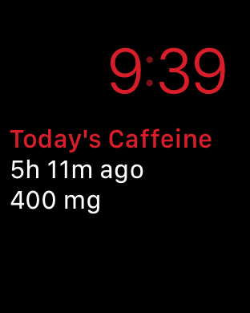
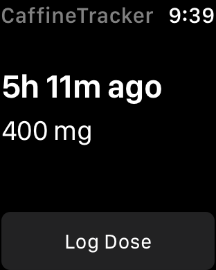
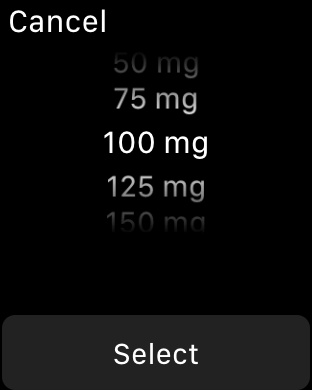

# CaffeineTracker

CaffeineTracker is an Apple Watch app for monitoring caffeine usage. Doses are recorded in HealthKit, and the time since the most recent dose, as well as total does for the day are displayed in the app, as well as on the complication.
 

## Known issues

- After adding/deleting entries in the Health app, the watch app will not display the changes immediately upon refreshing. It will generally do so after refreshing the _phone_ app. 

